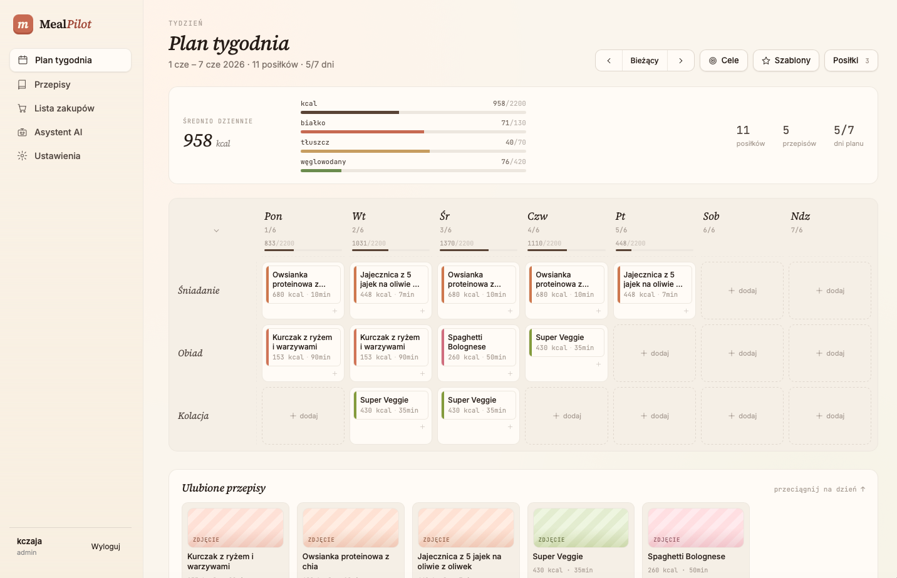
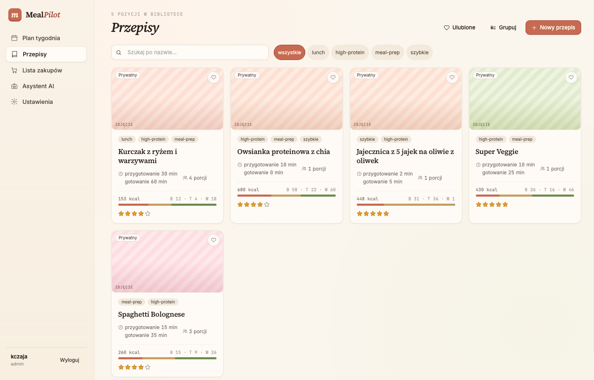
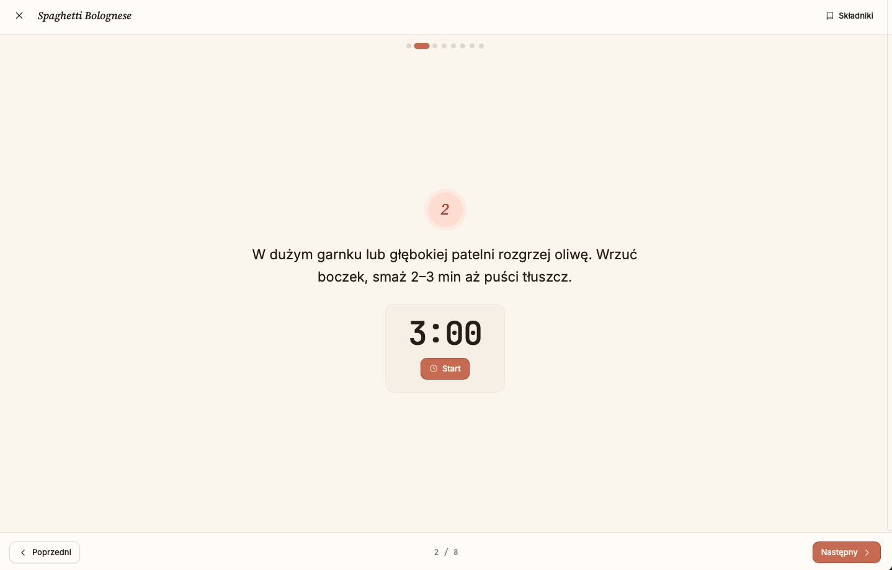

# MealPilot

> A full-stack meal-planning application built as a **Home Assistant Add-on** — weekly plan, AI meal assistant, shopping list, and step-by-step cooking mode, all served from your self-hosted smart-home hub.


---

## Why this project exists

Most meal-planning apps are SaaS with a monthly fee, a mobile-only UX, and no local data ownership. MealPilot runs entirely on your own hardware inside Home Assistant, costs nothing to host, and gives you an LLM assistant that actually knows your recipe library.

---

## Feature overview

| Area | What it does |
|------|-------------|
| **Recipe library** | Create/edit recipes with ingredients, macros, tags, images, ratings (1–5 ★), and private notes. Drag-and-drop reordering of steps and ingredients. |
| **Weekly planner** | Drag meals onto a 7-day calendar, generate a shopping list from the plan in one click. |
| **AI assistant** | Chat interface backed by any OpenAI-compatible endpoint (OpenAI, Anthropic, local Ollama, etc.). The agent can search your recipes, build plans, save week templates, rate dishes, and add shopping items — via a typed tool layer shared with the MCP server, not free-form text parsing. |
| **Streaming responses** | Agent replies stream token-by-token; tool invocations are surfaced live in the UI. |
| **Cooking mode** | Step-by-step view with per-step countdown timers and an audio alert when each stage ends. |
| **Shopping list** | Auto-generated from the week's plan; manually editable with checkboxes. |
| **Multi-user households** | Users belong to households and share recipes/plans. Admins control per-user AI access and monthly token/cost limits. |
| **API keys** | Users can generate long-lived API tokens for automation or external integrations (e.g. calling the agent from an HA automation), scoped `read` or `write`. |

---

## Local development

```bash
# clone and start the dev stack
git clone https://github.com/czajakamil/ha-addons
cd ha-addons/mealpilot
docker compose -f docker-compose.dev.yml up

# frontend hot-reload (separate terminal)
cd frontend && npm install && npm run dev
```

Backend auto-reloads on file changes via Uvicorn's `--reload` flag.  
The dev compose mounts `./data` so the SQLite database survives restarts.

---

## Installation (Home Assistant)

1. **Add repository** in HA → Settings → Add-ons → Add-on Store → ⋮ → Repositories:
   ```
   https://github.com/czajakamil/ha-addons
   ```
2. Install **MealPilot**, configure `admin_username` / `admin_password` and (optionally) `ai_api_url` + `ai_api_key`
3. Start the add-on — it appears in your HA sidebar immediately via Ingress

### Configuration options

| Key | Description |
|-----|-------------|
| `admin_username` / `admin_password` | Bootstrap admin account |
| `ai_api_url` | Any OpenAI-compatible base URL (e.g. `https://api.anthropic.com/v1`) |
| `ai_api_key` | API key for the LLM provider |
| `cors_origins` | Extra allowed origins (comma-separated) |
| `require_cf_access` | Enable Cloudflare Access JWT verification |
| `cookie_secure` | Set the `Secure` flag on session cookies (enable behind HTTPS) |

---

## AI agent — one tool registry

The agent does not rely on free-form instructions to manipulate data. Every action is a **typed tool**, and all 29 of them come from a single registry (`backend/app/services/registry.py`):

```
                     app/services/registry.py
                      (TOOL_SPECS — single source of truth)
                                 │
     ┌───────────────────────────┼───────────────────────────┐
     ▼                           ▼                           ▼
 in-app agent               MCP server                GET /api/agent/tools
 (TOOL_DEFS)                (Claude Desktop, …)       (tool modal in the UI)
```

Adding a tool means adding one `ToolSpec` — there is no second list to keep in sync, and no hand-maintained TypeScript copy in the frontend. The tools sit on a shared domain layer (`app/services/`) that the REST API uses too, so **visibility and edit rights are identical across REST, the agent and MCP**.

```
search_recipes      list_recipes        filter_recipes      get_recipe
list_tags           list_meal_types     create_recipe       update_recipe
delete_recipe       rate_recipe         set_recipe_note     share_recipe_with_household
get_week_plan       get_current_week_plan  set_week_plan    add_plan_entry
remove_plan_entry   get_week_nutrition_summary
get_shopping_list   generate_shopping_list  check_shopping_item  add_shopping_item
delete_shopping_item  clear_shopping_list
list_week_templates  save_week_as_template  apply_week_template  delete_week_template
estimate_recipe_macros
```

Every tool ships `ToolAnnotations` (`readOnlyHint` / `destructiveHint` / `idempotentHint` / `title`) and an `outputSchema`, so an MCP client can decide for itself when to ask the user for confirmation. Failures are real protocol errors (`isError = true`), not text that happens to start with `ERROR:`.

### Connecting Claude Desktop

The MCP server runs **in-process inside the add-on** and executes tools straight against the database. Point a client at the built-in HTTP endpoint — nothing to install locally:

```json
{
  "mcpServers": {
    "mealpilot": {
      "url": "http://<HA_IP>:8000/mcp",
      "headers": { "X-MealPilot-Token": "mp_xxx" }
    }
  }
}
```

`/mcp` is Streamable HTTP, the transport that supersedes SSE in the MCP spec, and it runs stateless — every request carries its own token. The older SSE pair (`GET /mcp/sse` + `POST /mcp/messages`) still works unchanged, so existing client configs keep working; `/mcp` is simply the better starting point for a new one.

API keys carry a scope: `write` (default) or `read`. A read-only key is rejected for unsafe HTTP methods and for any write tool over MCP — handy for dashboards and automations that only need to look.

The stdio entry point (`backend/mcp_server.py`) also exists, but because tools run in-process it needs direct access to the database file (`MEALPILOT_DB`) and must therefore run on the host that holds it. Inside the add-on, the HTTP transports (`/mcp` or `/mcp/sse`) are the supported path.

Full tool specification: [`AGENT_MCP_SPEC.md`](AGENT_MCP_SPEC.md)

## Screenshots






